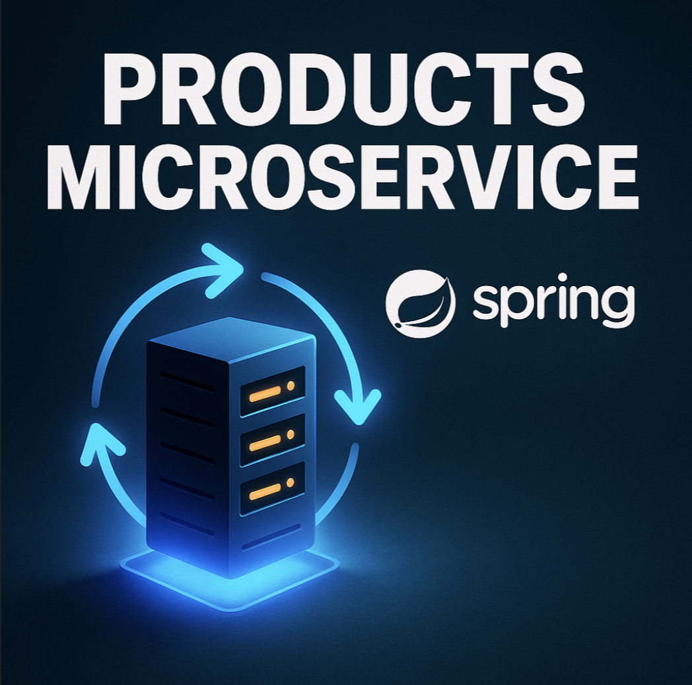

# Products Microservice - Spring Cloud
## 📌 Descripción
Este proyecto es un microservicio desarrollado con **Spring Boot** y **Spring Cloud**, que forma parte de una arquitectura basada en microservicios. Está diseñado para gestionar productos, incluyendo operaciones CRUD básicas, manejo de excepciones y controladores RESTful.

## 🧱 Estructura del Proyecto

```css
.
├── Dockerfile
├── HELP.md
├── pom.xml
├── src
│   ├── main
│   │   ├── java/com/backend/springcloud/msvc/products
│   │   │   ├── ProductsMicroserviceApplication.java
│   │   │   ├── controller/           # Controladores REST
│   │   │   ├── service/              # Lógica de negocio
│   │   │   ├── repository/           # Acceso a datos
│   │   │   ├── entity/               # Entidades (modelos)
│   │   │   ├── dto/                  # Objetos de transferencia de datos
│   │   │   ├── config/               # Configuraciones adicionales
│   │   │   └── exception/            # Manejo global de errores
│   │   └── resources/
│   │       ├── application.properties
│   │       ├── banner.txt
│   │       └── static/asets/img/msvc.png
│   └── test/java/com/backend/springcloud/msvc/products
│       └── ProductsMicroserviceApplicationTests.java
└── target/
```

## ⚙️ Tecnologías Usadas

* **Java 17**
* **Spring Boot**
* **Spring Cloud**
* **Spring Web**
* **Spring Data JPA**
* **Maven**
* **Docker**
* **Zipkin**
* **JUnit 5**

## 🗄️ Conexión a Base de Datos MySQL

La aplicación utiliza una base de datos MySQL configurada en el archivo `application.properties`. Asegúrate de tener una base de datos MySQL corriendo y con las credenciales adecuadas.

### Configuración básica en `application.properties`:

```properties
spring.datasource.url=jdbc:mysql://localhost:3306/products_db
spring.datasource.username=tu_usuario
spring.datasource.password=tu_contraseña
spring.datasource.driver-class-name=com.mysql.cj.jdbc.Driver

spring.jpa.hibernate.ddl-auto=update
spring.jpa.show-sql=true
spring.jpa.properties.hibernate.dialect=org.hibernate.dialect.MySQL8Dialect
```

### Dependencia en `pom.xml`:

Ya incluida en el archivo:

```xml
<dependency>
    <groupId>com.mysql</groupId>
    <artifactId>mysql-connector-j</artifactId>
    <scope>runtime</scope>
</dependency>
```

````

## 🚀 Cómo Ejecutar el Proyecto

### Pre-requisitos

- Java 17
- Maven
- Docker (opcional, si deseas contenerizar)

### Ejecutar con Maven

```bash
./mvnw spring-boot:run
````

### Construir el JAR

```bash
./mvnw clean package
```

### Ejecutar el JAR

```bash
java -jar target/PRODUCTS_MICROSERVICIOS_SPRING_CLOUD-0.0.1-SNAPSHOT.jar
```

### Ejecutar con Docker

```bash
docker build -t products-microservice .
docker run -p 8080:8080 products-microservice
```

## 💪 Tests

Los tests están ubicados en el paquete:

```
src/test/java/com/backend/springcloud/msvc/products/
```

Para ejecutar los tests:

```bash
./mvnw test
```

## 📁 Rutas de Interés

El controlador `ProductController` ofrece las siguientes rutas RESTful para la gestión de productos:

| Método | Ruta                    | Descripción                     |
| ------ | ----------------------- | ------------------------------- |
| GET    | `/products/list`        | Lista todos los productos       |
| GET    | `/products/find/{id}`   | Busca un producto por su ID     |
| POST   | `/products/create`      | Crea un nuevo producto          |
| PUT    | `/products/update/{id}` | Actualiza un producto existente |
| DELETE | `/products/delete/{id}` | Elimina un producto por su ID   |

## 🛠️ Manejo de Errores

La clase `GlobalHandlerException` captura excepciones como `ResourceNotFoundException` y responde con códigos HTTP adecuados.

## 📄 Licencia

Este proyecto está bajo la licencia **MIT**. Puedes consultar más detalles en el archivo `LICENSE`.

---
## 📬 Contacto

Para dudas, sugerencias o contribuciones, puedes escribir a:

📧 **[casseli.layza@gmail.com](mailto:casseli.layza@gmail.com)**

🔗 [LinkedIn](https://www.linkedin.com/in/casseli-layza/)
🔗 [GitHub](https://github.com/CasseliLayza)

💡 **Desarrollado por Casseli Layza como parte de una arquitectura de microservicios con Spring Cloud.**

_**💚 ¡Gracias por revisar este proyecto!... Powered by Casse 🌟📚🚀...!!**_

## Derechos Reservados

```markdown
© 2025 Casse. Todos los derechos reservados.
```